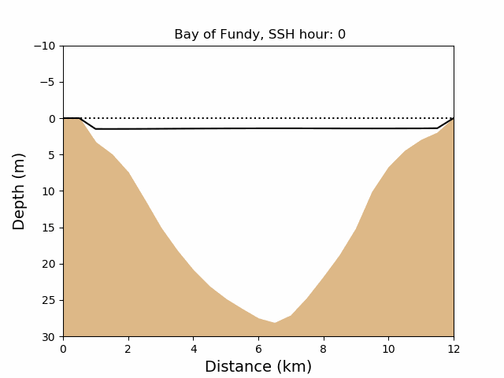
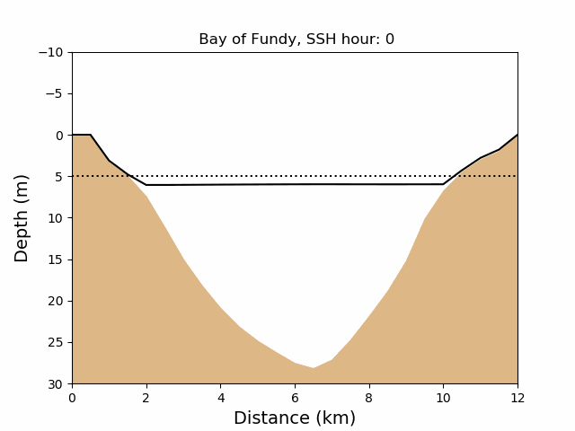

# Animations of Wetting and Drying in the Bay of Fundy 

### Wet grid points during 4 tidal periods, ref level = 0m
Reference mean sea level is 0m, minimum layer thickness is 20 cm

### Wet grid points during 4 tidal periods, ref level = -5m
Reference mean sea level is -5m, minimum layer thickness is 20 cm

### SSH evolution across Minas Basin, ref level = 0m  

### SSH evolution across Minas Basin, ref level = -5m  

